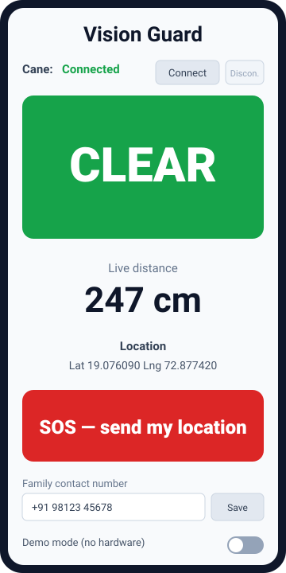

# Vision Guard — companion app

The family-facing companion app for the Vision Guard smart cane. Built in
**MIT App Inventor** and talking to the cane's **HC-05 (Bluetooth Classic)**
module, it lets a relative confirm the cane is working and get help fast.



## Features

- **Connection status** — shows whether the phone is linked to the cane.
- **Alert status** — a full-width **CLEAR** (green) / **OBSTACLE** (red) panel.
- **Live distance** — the cane sensor's reading in cm, refreshed ~5×/second.
- **GPS** — current latitude/longitude from the phone's location sensor.
- **SOS** — one big button texts the user's location to a saved family contact.
- **Demo mode** — a switch that streams simulated readings so the whole
  dashboard works with no hardware attached, for demos and testing.

Spoken feedback (TextToSpeech) announces connection changes and obstacles, so
the app is usable without looking at the screen.

## Build / run

The app is not shipped as a binary. **[`BUILD_GUIDE.md`](BUILD_GUIDE.md)** is a
complete, block-by-block recipe to build it in MIT App Inventor in ~30 minutes,
then export your own `VisionGuard.aia`. Start there.

Quick path once built: install **MIT AI2 Companion** on an Android phone, open
the project, **Connect → AI Companion**, and flip **Demo mode** on to see it run
before you have the cane.

## How it connects

The cane firmware (`../cane/cane.ino`) streams one line per reading over the
HC-05:

```
87,ALERT      distance in cm, comma, status
250,OK
```

Pairing is done once in Android's Bluetooth settings (passcode `1234`); the app
then connects to the already-paired HC-05 and polls it for these lines. See the
build guide for the full data-flow and block logic.

> **Android only.** Bluetooth Classic serial is not accessible to iPhone apps,
> and App Inventor targets Android.
